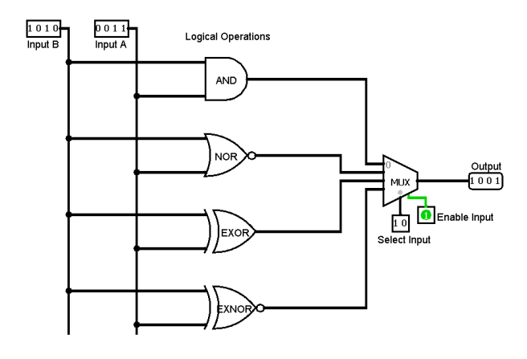
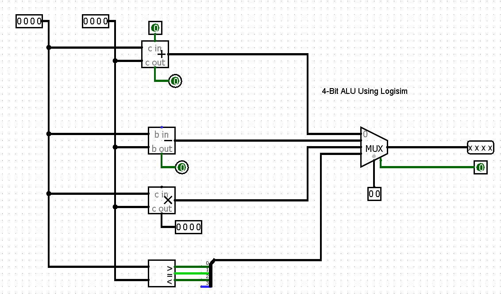

# 4-Bit ALU Using Logisim

This project is a 4-bit Arithmetic Logic Unit (ALU) designed and simulated using Logisim.  
The ALU performs multiple arithmetic and logical operations on two 4-bit inputs and produces a 4-bit output.

---

## Features

### Inputs
- **A (4-bit)** – First operand  
- **B (4-bit)** – Second operand  
- **Select Inputs (S1 S0)** – Choose operation  
- **Enable Input** – Enables the output  

### Outputs
- **F (4-bit Result)**  
- **Carry Out** (for arithmetic operations, if connected)

---

## Logical Operations

| Select (S1 S0) | Operation | Description |
|----------------|-----------|-------------|
| 00 | Addition (A + B) | 4-bit ripple carry adder |
| 01 | Subtraction (A – B) | Using 2’s complement method |
| 10 | Multiplication (A × B) | 4-bit multiplier |
| 11 | Logical operations | AND, NOR, XOR, XNOR block |

> Modify the table if your select signals are mapped differently.

---

##  Components Used
- 4-bit Adder  
- 4-bit Subtractor  
- 4-bit Multiplier  
- AND Gate  
- NOR Gate  
- XOR Gate  
- XNOR Gate  
- 4-Input Multiplexer (MUX)  
- Enable Control Logic  

---

##  Circuit Description

1. Inputs **A** and **B** go to all arithmetic and logical blocks simultaneously.  
2. Each block (Adder, Subtractor, Multiplier, AND/NOR/XOR/XNOR) computes its output.  
3. A **4×1 Multiplexer** selects one of the outputs based on **S1 S0**.  
4. The **Enable Input** determines whether the final output is shown.  

---

## Software Used
- **Logisim Evolution** (recommended)
- Digital logic building blocks

---

##  Purpose of the Project
This project demonstrates:
- ALU design concepts  
- Integration of arithmetic and logical circuits  
- Usage of multiplexers for operation selection  
- Digital logic simulation in Logisim  

---

## Keywords
`4-bit ALU`  
`ALU using Logisim`  
`Digital Logic`  
`Arithmetic Logic Unit`  
`Logisim Evolution`  
`Adder Subtractor`  
`MUX based ALU`  
`Logic Gates`

---

